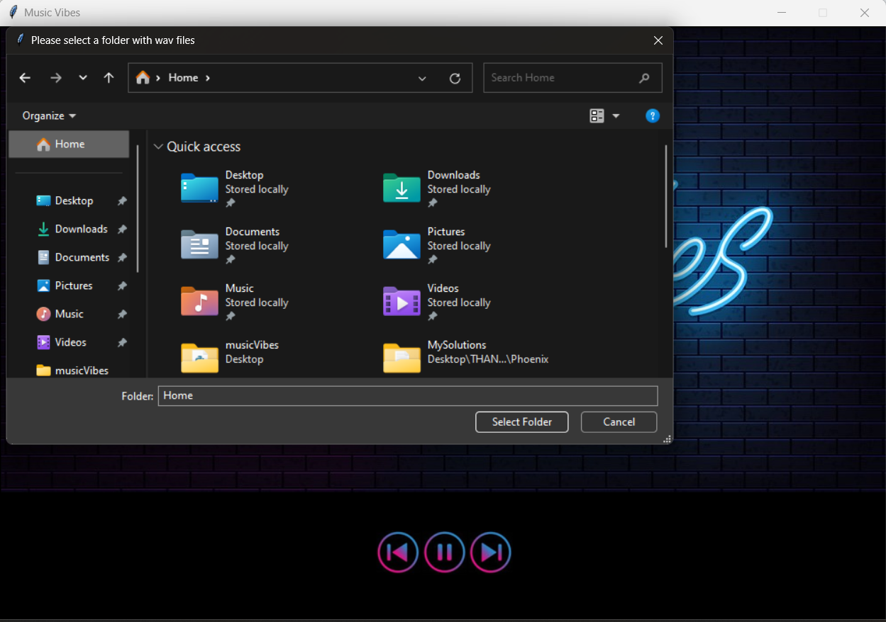
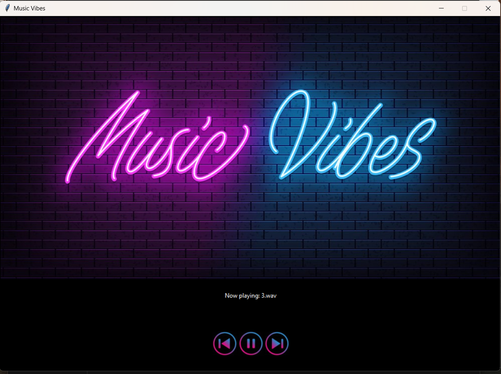

## Let's vibe with Music Vibes!!!

This is a simple GUI music player built with tkinter module. It also uses mixer module of pygame.

## 📷 Screenshots
### Select a folder with music files


### Main screen



### How to run it
First open the project's folder in a terminal and run the command:

```
pip install -r requirements.txt 
```

to install all the required modules that app will use. <br>

Then type:

```
python3 musicVibes.py 
```

Select a folder that has some music inside and let the app do its magic! The only thing you have to do is vibing!!!

## Disclaimer
For now it supports only files in .wav format.
